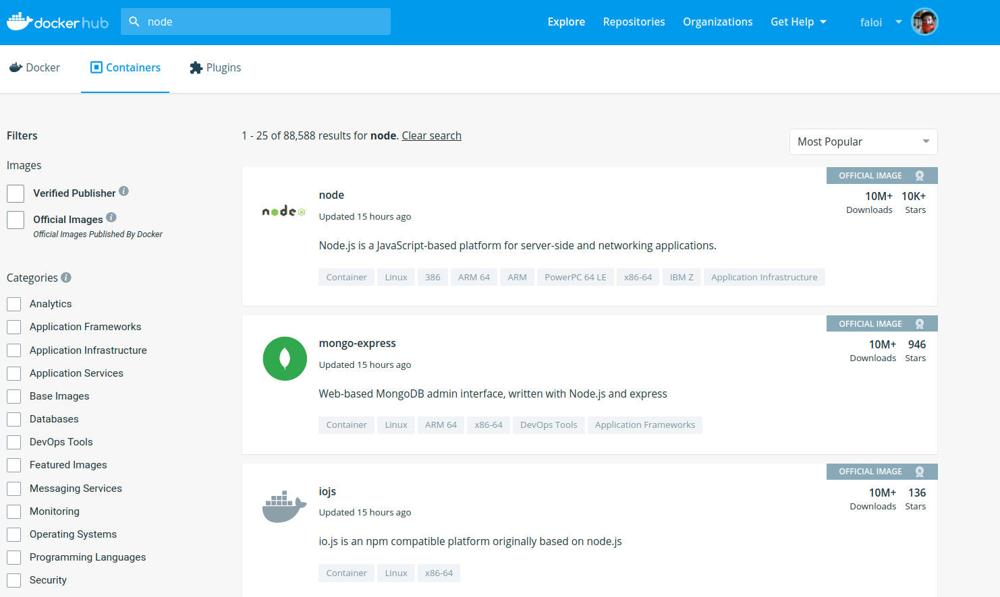
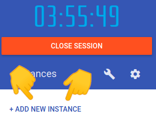

# Introducción a Docker 

(para desarrolladorxs)


===

## ¿Qué es Docker?

Dicho _muy_ en criollo, es una herramienta que permite crear, ejecutar y difundir mini máquinas virtuales, sin el embole de tener que configurarlas a mano.

Algo así como una forma de **programar** la infraestructura de una aplicación. 🤯

--

### Docker 🆚 Máquinas virtuales


===

## ¿Para qué sirve?

_Los contenedores son una unidad de software estandarizada, que permite a lxs desarrolladorxs aislar su aplicación de su ambiente, solucionando el dolor de cabeza de "en mi computadora funciona"._

<small>Containers are a standardized unit of software that allows developers to isolate their app from its environment, solving the “it works on my machine” headache.</small>

===

## Flujo de trabajo

<span style="font-size: 120px">🗒️</span> ⇒ _build_ ⇒ <span style="font-size: 120px">🐳</span> ⇒ _run_ ⇒ <span style="font-size: 120px">📦</span>

--

### 🗒️ Dockerfile 

Instrucciones para construir una imagen. 

```dockerfile
# Casi todas las imágenes "heredan" de otra
FROM node:12.22.1-alpine

# Configura el entorno
WORKDIR /opt/node/app
ENV NODE_ENV=production

# Copia el código del proyecto e instala sus dependencias
COPY package-lock.json .
COPY package.json .
COPY src .
RUN npm ci

# Configura el comando por defecto para esta imagen
CMD ["node", "app.js"] 
```

--

### 🐳 Imagen 

Paquete ejecutable que incluye todo lo necesario para levantar una aplicación: código, configuraciones, entorno, etc. 



--

### 📦 Contenedor 

Imagen que está siendo ejecutada. 

```shell
$ docker ps

CONTAINER ID        IMAGE                      COMMAND                  CREATED             STATUS              PORTS                                                                    NAMES
aa8278fcbb09        postgres:10-alpine         "docker-entrypoint.s…"   3 minutes ago       Up 3 minutes        0.0.0.0:5432->5432/tcp                                                   docker_postgres_1
4b75e4320afc        redis:alpine               "docker-entrypoint.s…"   3 minutes ago       Up 3 minutes        0.0.0.0:6379->6379/tcp                                                   docker_redis_1
891ffdc46e3e        elselabsio/fakes3          "/bin/sh -c 'fakes3 …"   3 minutes ago       Up 3 minutes        0.0.0.0:4567->4567/tcp                                                   fakes3
dc01076da854        nats:latest                "/nats-server -c nat…"   3 minutes ago       Up 3 minutes        0.0.0.0:4222->4222/tcp, 0.0.0.0:6222->6222/tcp, 0.0.0.0:8222->8222/tcp   docker_gnatsd_1
2cada385eaa4        verdaccio/verdaccio:3.11   "/usr/local/bin/dumb…"   3 minutes ago       Up 3 minutes        0.0.0.0:4873->4873/tcp                                                   docker_verdaccio_1
d1fab4dd1ac9        mongo:3.6                  "docker-entrypoint.s…"   3 minutes ago       Up 3 minutes        0.0.0.0:27017->27017/tcp                                                 docker_mongodb_1
```

===

## 🦾 Servidor web

En este ejercicio vamos a usar [Play with Docker](https://labs.play-with-docker.com/)

<small>(Para iniciar sesión van a tener que crearse una cuenta en Dockerhub)</small>



<br>

```shell
$ docker run -d -p 80:80 docker/getting-started:pwd
```

Cuando termines, entrá a `www.menti.com`, poné el código `9321 8112` y contestá la pregunta.

===

## ¿Qué acaba de pasar? 🤔

**`docker run`**
Descargamos automáticamente una imagen Docker.

**`-d`** La ejecutamos en segundo plano.

**`-p 80:80`** Redirigimos el puerto 80 del contenedor al 80 de nuestra máquina.

--

### Algunas cosas que podemos configurar

* **Variables de entorno:** por ejemplo: URL de un servicio externo, credenciales de la DB.
* **Puertos:** se pueden exponer los puertos necesarios, con el formato `PUERTO_HOST:PUERTO_CONTENEDOR`.
* **Volúmenes:** carpetas o archivos que querramos compartir con la máquina host.

--

### Un ejemplo "completo"

```bash
$ docker run -d
  -e REDIS_NAMESPACE='staging' \ 
  -e POSTGRES_ENV_POSTGRES_PASSWORD='foo' \
  -e POSTGRES_ENV_POSTGRES_USER='bar' \
  -e POSTGRES_ENV_DB_NAME='mysite_staging' \
  -e POSTGRES_PORT_5432_TCP_ADDR='docker-db-1.hidden.us-east-1.rds.amazonaws.com' \
  -e SITE_URL='staging.mysite.com' \
  -p 80:80 \
  --link redis:redis \  
  --name container_name dockerhub_id/image_name
```

<small>Tranqui, ya vamos a ver una forma más feliz de lograr lo mismo... 😏</small>

===

## 🦾 Base de datos

```shell
$ docker run --name mongo -d surprograma/corona-mongo
$ docker exec -it mongo bash

## Acá ya estamos adentro del contenedor
$ mongo
```

```mongo
use corona

// Búsquedas de un elemento
db.casos.findOne()
db.casos.findOne({ date : "2020-03-10" })

// ¿Qué día hubo 34 casos confirmados?
```

Cuando termines, entrá a `www.menti.com`, poné el código `9321 8112` y contestá la pregunta.

===

## Docker compose

En vez de pasar un millón de parámetros, lo escribimos en un archivo YAML.

```yaml
version: '3'
services:
  postgres:
    image: postgres:10-alpine
    restart: always
    ports:
    - "5432:5432"
    volumes:
      - ../data:/docker-entrypoint-initdb.d/
      - ./postgres:/var/lib/postgresql/data
  redis:
    image: redis:alpine
    restart: always
    ports:
      - "6379:6379"
  gnatsd:
    image: nats:latest
    restart: always
    ports:
      - "4222:4222"
      - "8222:8222"
      - "6222:6222"
  fakes3:
    container_name: fakes3
    image: elselabsio/fakes3
    restart: always
    ports:
      - "4567:4567"
    volumes:
      - ./fakes3:/fakes3/data
  mongodb:
    image: mongo:3.6
    restart: always
    ports:
      - "27017:27017"
    volumes:
      - ./mongodb:/data/db
```

===

# ¿Preguntas?

<div class="red-social">
  <i class="fab fa-youtube color"></i>
  <span><a href="https://youtube.com/c/elsurtambienprograma">El Sur también programa</a></span>
</div>
<div class="red-social">
  <i class="fab fa-telegram-plane color"></i>
  <span><a href="https://t.me/surprograma">@surprograma<a></span>
</div>
<div class="red-social">
  <i class="fab fa-instagram color"></i>
  <span><a href="https://instagr.am/surprograma">@surprograma<a></span>
</div>


